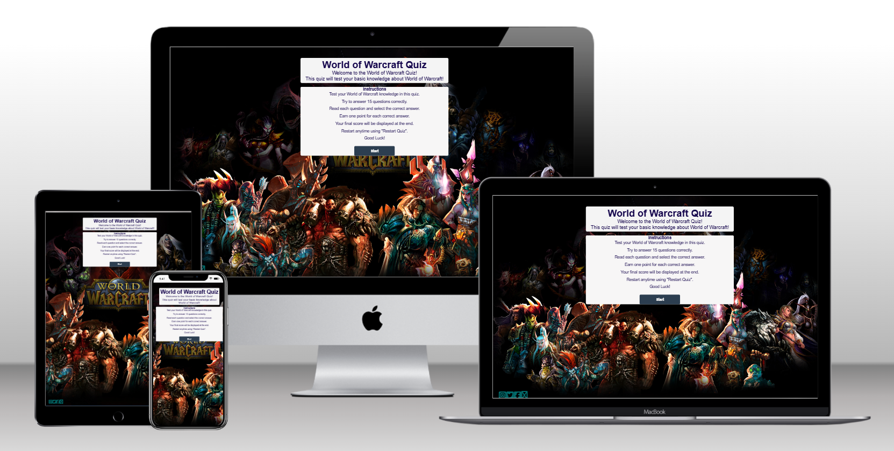

# WOW Quiz

Welcome to my World of Warcraft Quiz!

(Developer: Daniel Elde-Johansson)

[Live webpage]()

## Table of Content
1. [Introduction](#Introduction)
2. [Project Goals](#project-goals)
    1. [User Goals](#user-goals)
    2. [Site Owner Goals](#site-owner-goals)
3. [User Experience](#user-experience)
    1. [Target Audience](#target-audience)
    2. [User Requirements and Expectations](#user-requirements-and-expectations)
    3. [User Stories](#user-stories)
    4. [Site Owner Stories](#site-owner-stories)
4. [Design](#design)
    1. [Design Choices](#design-choices)
    2. [Fonts](#fonts)
    3. [Structure](#structure) 
    4. [Wireframes](#Wireframes)  
6. [Technologies](#Technologies)
    1. [Languages](#languages)
    2. [Frameworks & Tools](#frameworks-&-tools)
7. [Features](#features)
8. [Testing](#validation)
    1. [HTML Validation](#HTML-validation)
    2. [CSS Validation](#CSS-validation)
    3. [JavaScript Validation](#javascript-validation)
    4. [Accessibility](#accessibility)
    5. [Performance](#performance)
    6. [Devices](#Devices)
    7. [Browser compatibility](#browser-compatability)
    8. [Testing user stories](#Testing-user-stories)
9. [Bugs](#Bugs)
10. [Deployment](#deployment)  
11. [Credits](#Credits)  
12. [Acknowledgements](#acknowledgements)

## Introduction

Welcome to my World of Warcraft Quiz, There is 15 questions to prove that you have knowledge about World of Warcraft.

## Project Goals

### User Goals

* Finding a  WoW quiz. 
* Having fun.
* Testing your knowledge.

### Site Owner Goals

* Creating a fun and knowledgeable game that users will want to improve on until learning it all. 
* The game should be fully responsive to be able to be played on different devices.

## User Experience

### Target Audience
- casual gamers
- people who like World of Warcraft
- people looking to test there knowledge

### User Requirements and Expectations

* A simple and easy system
* Links and functions that work as expected
* A simple way to contact the developer
* Easy, and fun to play

### User Stories
1. As a user, I want to test my general knowledge
2. As a user, I want feedback on my correct answers
3. As a user, I want to know what the score i got
4. As a user, I want confirmation that my feedback was sent
5. As a user, I want to give feedback and try get other questions in

### Site Owner Stories
7. As a site owner, I want users to be able to contact us and give sugestions to new questions
8. As a site owner, I want users to be able to find us on social media.

## Design

### Design Choices

The Game was design so the picture can show the user what type of quiz it is, and to test there knowledge.

### Fonts

Sans-serif Was used through the whole website to make everything look the same.

### Structure

The page is structured in a well know, recognizable, user friendly, and easy to learn way.

* Introduction so you know where u are.
* instructions so you know what to do.
* social links and feedback bottom left so you can find us.

### Wireframes

## Technologies Used

### Languages
- HTML
- CSS
- JavaScript

